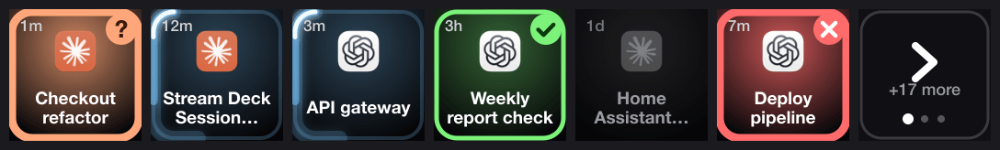

# AI Stream Decker

**Turn an Elgato Stream Deck into a live control center for your AI agents.**
Every Claude Code session and every ChatGPT/Codex thread gets its own key. The key shows what that agent is doing *right now*: thinking, waiting for your approval, finished, failed or idle. Pressing the key jumps straight into that exact session.



> Inspired by the OpenAI × Work Louder **Codex Micro** ("Your agents, in color"), a macro pad whose agent keys glow with real-time RGB status from Codex. It is sold out, and a Stream Deck has 15 tiny screens instead of RGB LEDs. So this project builds the same idea, with richer visuals, for hardware you may already own.

---

## Table of contents

- [What it shows](#what-it-shows)
- [Requirements](#requirements)
- [Install](#install)
- [Everyday use](#everyday-use)
- [How it works](#how-it-works)
  - [Architecture](#architecture)
  - [Claude Code](#claude-code)
  - [ChatGPT / Codex](#chatgpt--codex)
  - ["Seen" logic](#seen-logic)
  - [Key layout and paging](#key-layout-and-paging)
  - [Rendering pipeline](#rendering-pipeline)
- [Configuration](#configuration)
- [Prior art (why build this?)](#prior-art-why-build-this)
- [ChatGPT chat sessions (experimental)](#chatgpt-chat-sessions-experimental)
- [Limitations](#limitations)
- [Troubleshooting](#troubleshooting)
- [Project layout](#project-layout)

---

## What it shows

The palette follows the Codex Micro status colors, slightly saturated so they glow on the LCD keys:

| State | Look | Meaning | Codex Micro equivalent |
|---|---|---|---|
| **attention** | peach, pulsing border, wiggling icon, `?` badge | The agent is blocked on you: permission prompt, `AskUserQuestion`, plan approval | "User approval required / question" |
| **working** | blue, glowing comet orbiting the key | The agent is thinking or running tools | "Thinking" |
| **done** | green, breathing border, `✓` badge | Finished, and you haven't looked at it yet | "Unread chat" |
| **error** | red, pulsing, `✕` badge | The turn ended on an API or stream error | "Error" |
| **idle** | dimmed, grayscale icon, slow `zzz` | Nothing happening (idle sessions are listed too, as a quick switcher) | "Inactive" |

Every key also shows the **app icon** (Claude or ChatGPT), the **session title** (two lines) and the **time spent in the current state** (top left: `<1m`, `12m`, `3h`, `2d`).

## Requirements

- macOS (tested on macOS 26 / Apple Silicon)
- Node.js ≥ 22 (uses the built-in `node:sqlite`)
- An Elgato Stream Deck. Developed on a Stream Deck MK.2 / Original v2 (15 keys, 72×72 px). Other LCD models work too: key count and pixel size are read from the device.
- **The Elgato Stream Deck app must not be running.** This project talks to the device directly over USB HID, and only one program can own it.
- Claude Code (CLI and/or the Claude desktop app's Code tab) and/or the ChatGPT desktop app (bundle id `com.openai.codex`, which ships Codex)

## Install

```bash
git clone <this repo> AIStreamDecker && cd AIStreamDecker
npm install
node install.mjs
```

`install.mjs` is idempotent and does two things:

1. **Adds Claude Code hooks** to `~/.claude/settings.json` (a backup is written to `settings.json.bak-aideck`). Existing hooks are left alone.
2. **Installs a LaunchAgent** (`de.nfxmedia.aistreamdecker`) that starts the deck daemon at login and restarts it if it dies.

Uninstall everything:

```bash
node install.mjs --uninstall
```

## Everyday use

- **Press a session key** to jump into it:
  - Claude desktop sessions open via `claude://code/continue?session=local_…`.
  - Claude CLI sessions activate the terminal app they run in (from `TERM_PROGRAM`).
  - Codex threads open via `codex://threads/<id>`.
- **Press the pager key** (bottom right, `+N more`) to flip through additional pages. The deck returns to page 1 after 20 s without a key press.
- Watch what the deck is showing:

  ```bash
  tail -f ~/.ai-deck/deck.log
  ```
- Self-check of the hook state machine: `node test.mjs`
- Re-render the README preview after design changes: `node preview.mjs`

## How it works

### Architecture

```
 Claude Code (CLI + desktop) ──hooks──▶ hook.mjs ──▶ ~/.ai-deck/claude/<session>.json ─┐
 Claude desktop session store ─────────▶ …/Claude/claude-code-sessions/**/local_*.json ─┤ title, deep-link id, lastFocusedAt
 ChatGPT app / Codex ──────────────────▶ ~/.codex/state_5.sqlite  (threads)             ├──▶ deck.mjs ──USB HID──▶ Stream Deck
                                        ~/.codex/sessions/**/rollout-*.jsonl (events) ─┘        │   ▲
                                                                                                │   └── key press
                                                                     render.mjs (SVG → sharp → RGB) ◀┘
                                                                     open claude://… / codex://…
```

Everything is local. Nothing is sent anywhere, and no credentials or API tokens are touched.

### Claude Code

Claude Code hooks are the most precise signal available. `hook.mjs` is registered for these events and turns them into one small status file per session (`~/.ai-deck/claude/<session_id>.json`):

| Hook event | Resulting state |
|---|---|
| `UserPromptSubmit`, `PostToolUse` | working |
| `PreToolUse` | working, or **attention** for `AskUserQuestion` / `ExitPlanMode` (tools that block on you) |
| `PermissionRequest` | **attention** |
| `Notification` | **attention**, except the 60 s "still idle" ping after a finished turn, which must not re-flag a session you already saw |
| `Stop` | **done** |
| `StopFailure` | **error** |
| `SessionStart` / `SessionEnd` | registers / removes the session |

The state logic lives in the hook, not in the daemon, so the daemon can restart at any time without losing state. `test.mjs` exercises every transition.

**Desktop mapping.** The Claude desktop app keeps one JSON file per Code-tab session. It contains `cliSessionId` (the id hooks see), `sessionId` (`local_…`, used by the deep link), `title`, `isArchived` and `lastFocusedAt`. The daemon joins both, so desktop sessions show their real title and open in the right tab. Desktop sessions without any hook activity yet are listed as idle.

### ChatGPT / Codex

The ChatGPT desktop app stores every Codex thread in `~/.codex/state_5.sqlite` (`threads` table: title, `rollout_path`, `archived`, `updated_at_ms`). Each thread also has an append-only *rollout* JSONL file. The daemon reads the last ~512 KB of each active rollout, cached by file size, and takes the most recent lifecycle event:

| Rollout event | State |
|---|---|
| `task_started` | working |
| `task_complete`, `turn_aborted` | done |
| `error`, `stream_error` | error |
| `exec_approval_request`, `apply_patch_approval_request`, `request_user_input` | attention |

Sub-agent threads (`source` is a JSON object) are hidden. Archived threads disappear. "Work" and voice threads from the app are included.

### "Seen" logic

A finished session stays green until you have looked at it:

- pressing its key marks it seen (persisted in `~/.ai-deck/seen.json`);
- for Claude desktop sessions, opening the session in the app counts (`lastFocusedAt`), and so does a session that finishes *while it is on screen* (Claude is the frontmost app and the session is the most recently focused one);
- anything that finished more than 12 h ago is treated as seen, so old history never lights up.

### Key layout and paging

Sessions are ranked by importance: **attention > error > done > working > idle**, then by recency. The top sessions get **stable key positions**: a key keeps its session while that session stays on page 1, and new sessions take free keys. Status changes therefore don't reshuffle the deck under your fingers. When there are more sessions than keys, the last key becomes a pager and the overflow is spread over further pages.

### Rendering pipeline

`render.mjs` builds one SVG per key (radial status glow, animated border, app icon, title, badge) and rasterizes it with [sharp](https://sharp.pixelplumbing.com/) into the raw RGB buffer the device expects. The JPEG encoding for the device happens inside `@elgato-stream-deck/node` (libjpeg-turbo).

Animations (orbiting comet, pulse, breathing, `zzz`) are **quantized into a fixed number of phases**. Identical frames produce identical SVG strings, which hit an in-memory raster cache, and a key is only re-sent to the device when its SVG actually changed. The time label uses minute granularity for the same reason. The result is smooth ~12 fps animation at a few percent of one CPU core.

## Configuration

Tunables are constants at the top of [`deck.mjs`](deck.mjs):

| Constant | Default | Meaning |
|---|---|---|
| `WINDOW` | 3 days | sessions without activity for this long are hidden |
| `DONE_FRESH` | 12 h | a finished session stays highlighted this long unless you look at it |
| `STALE_WORK` | 30 min | "working" without any sign of life for this long is shown as idle (crashed sessions) |
| `PAGE_RESET` | 20 s | return to page 1 after this long without a key press |
| `BRIGHTNESS` | 70 | panel brightness in percent |

Colors and animation timings live in [`render.mjs`](render.mjs) (`COLOR`, `stateLayer`).

## Prior art (why build this?)

As of October 2026:

- **Codex Micro** (OpenAI × Work Louder) is dedicated hardware with RGB agent keys, approve/deny keys, a reasoning knob and a joystick. It covers Codex only and is sold out.
- **Stream Deck plugins for Claude Code** (e.g. *stream-deck-claude-code*, *agent-vitals*, *claudeck*, *agentsd*) are Elgato SDK plugins. They require the Elgato app and only cover Claude Code.
- There is reportedly an official Elgato marketplace plugin for **ChatGPT & Codex**, again tied to the Elgato app and to OpenAI only.

None of them shows **Claude Code and Codex side by side**, and none deep-links into the *exact* desktop session. Driving the device directly over HID also removes the dependency on the Elgato app and its plugin packaging.

## ChatGPT chat sessions (experimental)

Plain ChatGPT conversations (not Codex threads) are **not shown yet**. Unlike Codex, they live on the server: the app keeps no live local record of them. The only local cache (`codex.chatgpt-conversations` in the app's LocalStorage) is a stale list snapshot.

The remaining local signal is the app's UI itself. [`gpt-ax/`](gpt-ax) contains a small Swift bridge (`AIStreamDeckerGPT.app`) that reads the ChatGPT window via the macOS Accessibility API. It dumps the tree to `~/.ai-deck/gpt-ax.json` and can press elements on request. All interpretation is meant to happen in JS, so the binary never needs rebuilding. It is installed only with `node install.mjs --gpt` and needs **Accessibility permission**.

Status: on the development machine, macOS (26) has not yet applied the grant to the bridge reliably. The details are in the troubleshooting section below. Once it reads the tree, the plan is to parse the sidebar's chat list and streaming indicators into the same state model.

## Limitations

- Ordinary Claude chats (outside the Code tab) have no status interface and are not shown.
- Codex approval prompts appear as attention only if Codex writes the request into the rollout. Otherwise the thread stays "working".
- For Codex, "seen" only works by key press, because the app does not record which thread you are looking at.
- Sessions that ran before installation appear after their next hook event (desktop sessions appear immediately as idle).
- A crashed "working" session turns idle after `STALE_WORK`. There is no process liveness check.

## Troubleshooting

| Symptom | Fix |
|---|---|
| Deck stays dark | Quit the Elgato Stream Deck app, then `launchctl kickstart -k gui/$(id -u)/de.nfxmedia.aistreamdecker` |
| A Claude session never changes state | It was started before the hooks were installed. Send it one more prompt, or restart it. |
| `deck.log` shows `codex read failed` | The ChatGPT app is migrating its database. It recovers on the next refresh. |
| GPT bridge reports `"trusted": false` | Remove every `AIStreamDeckerGPT` / `gpt-ax` entry under *System Settings → Privacy & Security → Accessibility*, run `tccutil reset Accessibility de.nfxmedia.aistreamdecker.gpt`, then add `gpt-ax/AIStreamDeckerGPT.app` again. `build.sh` signs with your *Apple Development* identity when one exists, so the grant survives rebuilds. |

## Project layout

| File | Purpose |
|---|---|
| [`deck.mjs`](deck.mjs) | daemon: data sources, ranking, stable slots, paging, device I/O, key presses |
| [`render.mjs`](render.mjs) | key artwork (SVG), animation phases, raster cache |
| [`hook.mjs`](hook.mjs) | Claude Code hook → per-session status file |
| [`install.mjs`](install.mjs) | installs/uninstalls hooks and LaunchAgents |
| [`test.mjs`](test.mjs) | self-check for the hook state machine |
| [`preview.mjs`](preview.mjs) | renders `docs/preview.gif` |
| [`gpt-ax/`](gpt-ax) | experimental Accessibility bridge for ChatGPT chats |
| `assets/` | app icons, extracted from the installed apps by `install.mjs` (not committed: vendor trademarks) |
